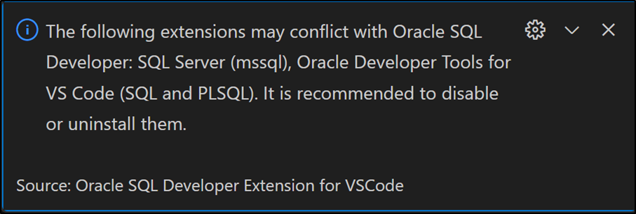

# SETTING UP YOUR DEVELOPER ENVIRONMENT

One of the most important steps in software development is setting up a development environment, which entails establishing the hardware and software that will be used to write, test, and run code.

Installing the required tools and configurations is the first step towards setting up an effective developer environment.

## Select Your Operating System (OS):

Windows Operating System is a computer program that manages all computer resources and uses a Graphical User Interface (GUI) that allows users to interact with the computer through icons, buttons, and visual menus, rather than using text commands like other operating systems

### Steps to Download and Install Windows 11:
1.	Purchase a Windows installation media ISO/DVD or download a windows 32 or 64 bit setup (It can be accessed on this website: Download Visual Studio Code - Mac, Linux, Windows) depending on your machine's compatibility.
2.	Use a running computer to format a USB Drive with at least 5GB Storage space. Activate the primary partition on the USB flash
3.	Copy the contents of the windows product DVD/ISO to the USB Flash drive
4.	Connect the USB Drive to the designated Computer. Open the boots -device selection menu and install Windows to the new PC.

   ### Challenges faced:
1.	Getting into the bootstrap menu proves to be tricky especially when one is not familiar with the process. The keys needed to access the menu vary depending on the system. 

This challenge can be overcome by attempting the various keys e.g. F2, F12 until the menu was accessed

2.	When the creating a bootable USB drive, data may be lost as a result. This can be frustrating especially if the data in the USB drive is important. 

This problem is avoided by creating a backup of the data on the drive to ensure that important data is safe, even if the drive is accidentally formatted.
   

## Install a Text Editor or Integrated Development Environment (IDE):

A text editor is a type of computer program that enables users to create and edit a range of programming language files. An example of a text editor is Visual Studio Code.

VS Code is a source code editing application that was developed by Microsoft. It aims to provide the tools a developer needs for a quick code-build-debug cycle 

### Steps to download Visual Studio code:
1.	First visit the Visual Studio Website on your browser. 
2.	Download the VS Package specifically for the Operating System you use.
3.	Go to your downloads on your computer and open the .exe file
4.	Start the installation by clicking Run and selecting next until you reach the install button. 
5.	Select install then select Finish to Launch Visual Studio Code.
6.	Open the VS Code Application and navigate to the Extensions to install extentions for your text editor.

   ### Challenges faced when setting up the text editor:
1.	VS Code requires for specific systems to be installed in your machine for it to operate. Example given, a windows operating system. 

To overcome this, ensure that all necessary prerequisites are installed before trying to install VSCode e.g. ensuring that you have an Windows OS

2.	VSCode may not be compatible with older operating systems or outdated hardware. 

In such cases, upgrading the operating system or hardware may be necessary. To help prevent this, consider using a lightweight code editor like Visual Studio Code Portable or Atom instead.
  

## Set Up Version Control System:
 
 Version Control Systems are software tools that help software teams to track changes, manage changes, collaborate and maintain source code over time.
Git is an example of a well-known open-source distributed version control system that can easily be installed and used on Windows.

   ### Steps to Install Git on Windows:

1.	Visit the official Git website https://desktop.github.com/ 
2.	Go to the latest version of Git for Windows and download the package suitable for your operating system (32 or 64 bit)
3.	Go to your downloads and open the installer to run it. 
4.	The prompts must be followed in order to complete the installation process.
5.	After it has been installed. Open the command prompt on your computer and run as an administrator.
6.	Verify that git has been installed by typing the command

git -- Version 

A message will be displayed as shown in the example below:

git version 2.45.2.windows.1

7.	After installing Git configure Git by typing in your command prompt

global user.name "Your Name"

global user.email "Your Email"
These commands are used to set up your user name and email address associated with your projects. The email address will be set for all repositories you create and clone in the machine and also the commits you make on your local machine or push to remote repositories through the machine's Secure Socket Shell (SSH) key.

   ### Setting up Version Control Systems on Windows can pose unique challenges:

1.	One of the challenges is the compatibility of various VCS tools. Git was originally built for UNIX like systems and may not function optimally on windows without additional tools or configurations.

To avoid this, ensure that you install Git for windows. It includes an environment like Unix and simplifies the installation and usage of Git on Windows. 

## Install Necessary Programming Languages and Runtimes:

Python is a general-purpose language which is designed to be used in a range of applications. It is often used to build websites/software, automate tasks and conduct data analysis.

Setting up Python Involves the following steps.

1.	First visit the official Python Website and download the latest version of python for Windows. Be sure to choose the installer for your Version of Windows (32 bit or 64 bit)
2.	Go to your downloads. Open and run the Python installer. 
3.	Select the default python installer.
4.	Set the path manually on your machine by opening the ‘Edit the System Environment Variables’ application on your computer.
5.	Go to Environment variables. 
6.	Click on 'Path' and select edit.
7.	Select 'New' and paste the path to your Python installation folder.
8.	Click ok to save the changes.
9.	Verify that python was installed by opening the cmd application on your computer and running it as an administrator. Type the command:

python --version

   Setting up python on Windows can pose unique challenges:
1.	Compatibility issues can be presented with various software packages required by certain libraries or dependencies not being included in the installer package.

To overcome this type or setback, it is essential to look up the necessary prerequisites before attempting to setup. Seeking help from online communities such as Stack Overflow.

 
## Install Package Managers:

Package managers are tools that simplify the process of installing, managing and updating third libraries or packages. 
Pip is the default package installer for Python. 

 ### Setting up pip on Windows:
1.	Open your Command Prompt and run as administrator. 
2.	Check if python is installed. 
3.	Open the system’s PATH environment and check if the Python PATH has been added.
4.	On your command prompt, install pip by typing

python -m ensurepip --default-pip

This command will automatically check if pip is installed and install set up tools and wheel packages required by pip to function correctly.
5.	Verify that pip is installed by typing in the command prompt

pip --version

   During the set-up process of Pip on windows, users may face challenges.
1.	Firewall setting can block internet access required for downloading packages from PyPI.

This can be resolved by configuring firewall settings accordingly.

## Configure a Database (MySQL):

MySQL is a relational database management system. It is open-source system with numerous features.
MySqL installer for windows provides a friendly user interface which makes it easy to navigate and control the installation process.

### The following are steps to install MySql for windows:

1.	Go to your browser and search for 'MySql'. 
2.	Navigate to the website and choose the mysql package you want to download.
3.	Select the download link to download the file. Execute the MySql installer file from the download folder.
4.	Accept the license agreement terms. You can select predefined products that are going to be installed or customize your own MySql set up.
5.	When you get to 'Accounts and Roles', enter a password for your MySql root user and click next.
6.	After applying the necessary configurations to suit your environment, finish the installation.
7.	To verify if MySql is installed. Go to your start button and search for Mysql to see the applications.

   ### Challenges faced include:
1.	MySql has prerequisites for its compatibility. These include, sufficient disk space, memory and a compatible process.

It is important to ensure that the system meets the prerequisites before installing MySql.

2.	Firewalls block incoming connections to the database server. 

To fix this, configure the firewall to allow traffic on the required ports. The default port is 3306.

## Set Up Development Environments and Virtualization (Optional):
 
Consider using virtualization tools like Docker or virtual machines to isolate project dependencies and ensure consistent environments across different machines.

Data virtualization tools create a software layer between the applications accessing the data and the systems storing it. This technology can be used to create virtual representation of servers, storage, networks and other physical machines.
Docker is an open platform that allows you to build, test and deploy applications quickly.

### In order to install Docker:
1.	Go to your browser and access the Docker website https://docs.docker.com/desktop/install/windows-install/ 
2.	Download a suitable Docker installer
3.	Select the downloaded Installer (Docker Desktop Installer.exe) and run it. 
4.	You can use the WSL 2 instead of Hyper -v option on the configuration page depending on your choice.
5.	Follow the instructions on the installation wizard.
6.	Proceed to installing
7.	In order to check if Docker is installed, search for Docker on your computer. A Docker Desktop Application will appear on your search results  

### Challenges when setting up Docker:
In certain cases, the Boot2Docker VM might require a password. 
This can be resolved by running the following commands
	boot2docker delete 
	boot2docker download 
	boot2docker init
These commands remove the Virtual machine (VM), get the latest ISO and creates a new VM

## Explore Extensions and Plugins:
Plugins and extensions are optional features that can be added to the computer graphics software to expand its functionality, performance or creativity.

### How to explore extensions and plugins:
1.	Open Visual Studio Code (VS Code)
2.	On the side bar, select the square icon that represents the extensions or press ctrl+shift+x on your keyboard
3.	Search for the relevant extensions you need by typing in the search bar and pressing enter.
Examples of VSCode extensions are Python, Pylance and Snowflake
4.	When the results are displayed of the extension you searched for, select install next to the extension result
5.	Installed extensions can be managed from the Extensions view 

### Challenges:

Some extensions may conflict. 
This can be resolved by removing or uninstalling conflicting extensions.

Figure 1: Conflicting extensions
   
